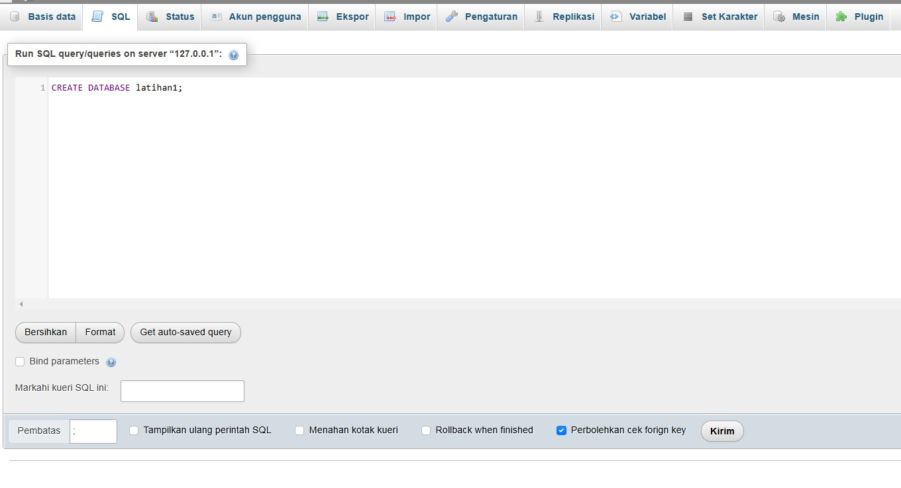
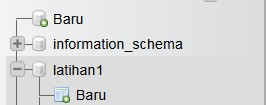

# Lab8Web

## Membuat Database melalui MySQL & phpMyAdmin beserta PHP & HTML
### Membuat Database di phpMyAdmin
Pertama - tama masuklah ke dalam phpMyAdmin, lalu buatlah database baru dengan nama "latihan1" :

Lalu, Buatlah 

